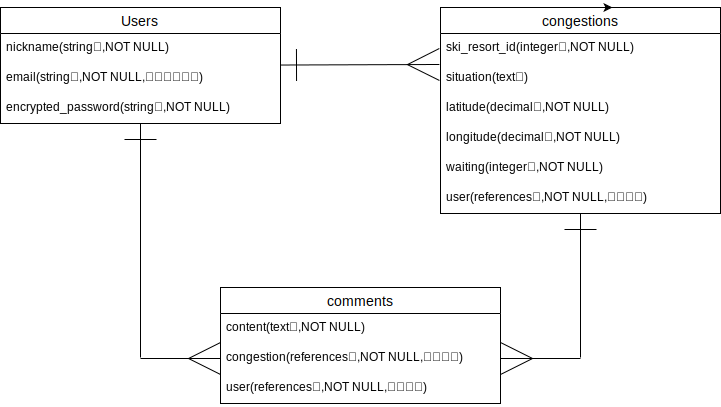

# アプリケーション名
AVOIDSTUCK

# アプリケーション概要
主にスキースノーボードをする方に向けに作成した、スタックを回避することでストレスなくスキー場への運転ができるアプリ。  
ユーザーがスタック情報投稿ができ、またその他のユーザーはそれらの投稿の情報を元にスタックを回避することができる。  
※スタックとは雪にタイヤが埋まり動けなくなる現象のこと。
# URL
http://18.182.213.189/

# テスト用アカウント
- Basic認証パスワード：admin  
- Basic認証ID：2222  
- メールアドレス：test@test.com
- パスワード：aaa111

# 利用方法
## スタック投稿
1. トップページ（一覧ページ）のヘッダーからユーザー新規登録を行う  
2. NewStuckボタンから情報の内容（現在地情報・スキー場・状況・待ち時間・画像）を入力し投稿する
## 情報閲覧
1.一覧ページから情報をクリックし詳細を確認する

# アプリケーションを作成した背景
スキー場への道中でスタックに遭遇した自身の経験から、同様の問題を抱えている方も多いと推測し、投稿から回避できるアプリケーションを開発することにしました。

# 洗い出した要件
https://docs.google.com/spreadsheets/d/1AE68r5MZd7iHtCUW1pAJUkY0x89ThRmQc9UWF_AFv6Y/edit#gid=1785908763

# 実装予定の機能
解決ボタン機能  
お気に入り機能  
いいね機能  
コメント機能  
フォロー機能  
# データベース設計

# 画面遷移図

# 開発環境
- Ruby
- Ruby on Rails
- MariaDB
- Github
- AWS
- Visual Studio Code

# ローカルでの動作方法
以下のコマンドを順に実行。
% git clone https://github.com/carton04/avoidstuck.git
% cd avoidstuck
% bundle install
% yarn install

# 工夫したポイント
・googlemapAPIの表示を現在地ボタンひとつで保存  
スタック情報を登録する際に、ユーザーがわざわざ現在地の住所を調べて入力するのは、面倒で使いづらいのでは、と考えました。そこで、Webブラウザのgeolocationオブジェクトを用いて、javascriptでユーザーの現在地（経度・緯度）を取得し、投稿ページからボタンを押すことでフォームに位置情報が自動入力されるようにいたしました。  
これにより、投稿のストレスが減り、より多くの方に気軽に投稿いただけるようになると考えています。